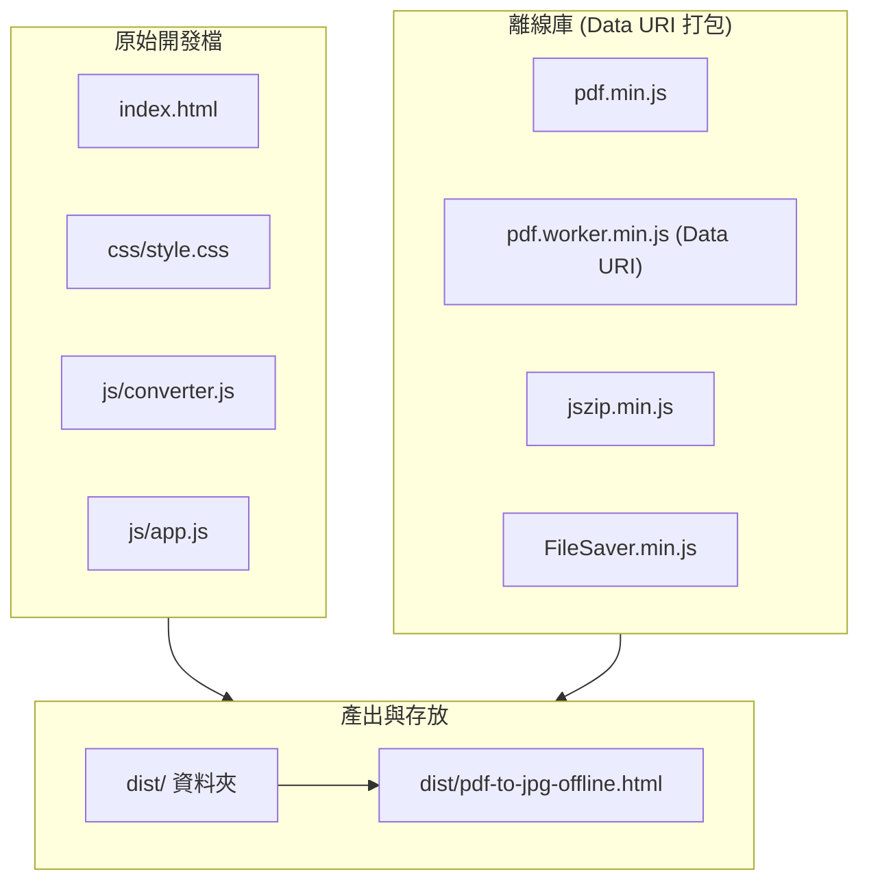

# SDD 提案：單檔案離線 Package 與主頁下載整合

- **提案名稱**：offline-package
- **建立日期**：2026-07-27
- **狀態**：已完成

## 1. 背景與需求

使用者希望擁有一個可 **100% 離線（Offline）**、**單一 HTML 檔案** 的 PDF 轉 JPG 工具包，以利在無網路連結或限制嚴格的內網環境下攜帶與使用。
同時需要在專案主頁 (`index.html`) 上提供下載此單一離線 HTML 包的按鈕與連結。

## 2. 目標與驗收標準

1. **離線單檔 (`dist/pdf-to-jpg-offline.html`)**：
   - 包含 HTML、CSS (樣式)、全體 JS (應用邏輯) 與第三方依賴 (PDF.js, Worker, JSZip, FileSaver.js)。
   - 移除所有外部 CDN 請求（含 Google Fonts），完全透過本地系統字型與內嵌資源運作。
   - Worker 以 Data URI 方式解碼載入，徹底解決 `file://` 協定下 Origin 為 `null` 導致的 `blob:null` 錯誤。
2. **目錄結構**：
   - 建立 `dist/` 資料夾，存放 `pdf-to-jpg-offline.html`。
3. **主頁下載導覽**：
   - 在 `index.html` 操作區域與頁腳新增明顯的下載按鈕，連結至 `dist/pdf-to-jpg-offline.html`。

## 3. 技術方案與資安評估

### 3.1 Data URI Worker 載入機制
為了相容於 `file://` 本地檔案開啟模式，避免瀏覽器將 `Blob URL` 解析為同源政策禁止的 `blob:null/<uuid>`：
```javascript
const workerRawCode = PDF_WORKER_JS_CODE;
const workerUrl = 'data:text/javascript;charset=utf-8,' + encodeURIComponent(workerRawCode);
pdfjsLib.GlobalWorkerOptions.workerSrc = workerUrl;
```

### 3.2 資安評估 (Security Evaluation)
- **資料隱私**：100% 於本地記憶體完成運算，零外部 HTTP 請求，徹底杜絕網路監聽與資料外洩。
- **沙盒防護**：Data URI 的 Worker 依然運行於受限的 Web Worker 沙盒內部，無法讀取本機硬碟檔案或 Cookie。
- **CSP 標頭**：`default-src 'self' data: blob: 'unsafe-inline'`，僅許可 `data:` 網址供內部腳本載入，未放行外部未授權網域。

## 4. 架構設計


